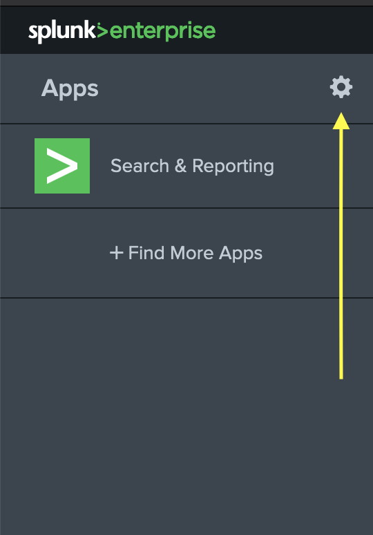
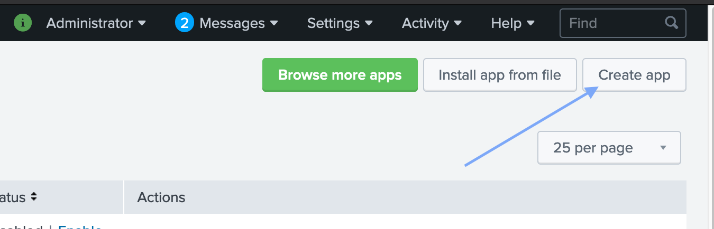
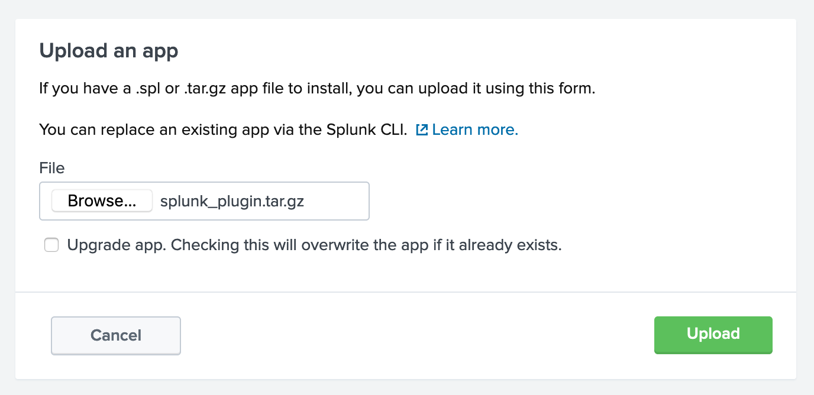

# hdf-json-to-splunk
Splunk plugin to upload Inspec output, Heimdall Tools output, and any other HDF format files to Splunk, for consumption by Heimdall Lite.
The format in which these are uploaded guarantees that they will not be truncated, that they are relatively easy to search, and that they can be easily reconstructed into the original JSON (with filters applied, if one so desires).

Credit to Dan Mirsky and Yarick Tsagoyko of DigitalInfuzion for the initial framework for the plugin, including the S3 integration and the automated file scanning python input, as well as for their assistance and advising on how best to develop the event schema.

## Installation

These steps require you to be an admin.

### To setup the splunk plugin:
 1. First, download the latest release .tar.gz of the plugin from the releases tab of this github project.

 2. Then, open your splunk web dashboard and go to your splunk app settings from the left sidebar.
    

 3. Then, click the "Install app from file" button in the top right.
    

 4. Finally, click "Browse" and select the .tar.gz file you downloaded in step one. Only check Upgrade App if you are reinstalling or upgrading this app to a new version. Press "Upload" and the app should be active!
    

### Feeding the plugin new data:
 * The plugin will consume and *and delete* any json file put into its `pickup` directory.
 * This directory, if installed via the method above, will be at `/opt/splunk/etc/apps/hdf_splunk_plugin/pickup/` on your splunk server instance.
 * Essentially any method of putting files into that folder - scp, ftp, etc - will work. 
 * As a simple not-build-for-production example, we have included the file `s3_sync_cron.sh`, which if enabled via a cron job will fetch all files from that bucket and feed them into the splunk pickup directory.

### Reading this data back out in Heimdall Lite:
 * To actually read the data from Heimdall Lite, some small further changes must be made. CORS protocols will block Heimdall Lite's attempts to connect to the Splunk Server management port, found at https://mysplunkserver.com:8089.
 * To resolve this networking error, you must add the following to your global `server.conf` on the Splunk instance.
    ```
    [httpServer]
    crossOriginSharingPolicy = *
    ```
 * Further information on configuring this, including details on how to set more specific filters than the `*` in the example, can be found here:
    https://docs.splunk.com/Documentation/Splunk/latest/Admin/Serverconf

## More info

### Data Structure produced by the converter

#### Execution Report Header Event structure  

```yaml
[
    {
        "statistics": { 
            // How long this evaluation run took, in seconds
            "duration": 0.501324
         },
        "platform": {
            // The platform release version
            "release": "18.2.0",
            // The platform name  
            "name": "mac_os_x"
        },
        "meta": {
            // Example given. The Globally Unique Identifier string tying all events in this 
            // file together. 
            // Keying on this is the best way to get all events in a single execution.
            "guid": "bXZNMQ3mNOs2PvHFv6Ze48RCdxI2FM",
            // The name of the file that was consumed to produce this event. 
            "filename": "E.g. my_profile_results.json",
            // Whether this was the result of inspec exec <profile> or inspec json <profile>, 
            // respectively.
            "filetype": "evaluation | profile",
            // This identifies this event as a header event. Note the matching meta field in 
            // other event types.
            "subtype": "header",
            // When it was parsed/ingested into the splunk app, in ISO time format. NOT when 
            // the profile was started!
            "parse_time": "2020-01-23T01:07:18.795438",
            // The start time of the profile in ISO format, as given by Inspec. 
            // Not guaranteed to be present (if no results), but usually present
            "start_time": "2020-01-23T01:07:18.795438",
            // the version of the schema used to produce this event.
            "hdf_splunk_schema": "1.0"
        },
        // The version of inspec that generated this file
        "version": "3.0.52"
    },
```

#### Profile Event structure  

```yaml
    {
        "meta": {
            // See Header for description
            "guid": "bXZNMQ3mNOs2PvHFv6Ze48RCdxI2FM",
            // See Header for description
            "filetype": "evaluation | profile",
            // See Header for description
            "filename": "",
            // This identifies this event as a control event. Note the matching meta field 
            // in other event types
            "subtype": "profile",
            // The SHA256 Hash of this profile, as generated by inspec
            "profile_sha256": "4bd9e49391dfd78bec6feeafbe8d212581daac43fcb734473d8eff86c863e219",
            // See Header for description
            "parse_time": "",
            // See Header for description
            "start_time": "",
            // See Header for description
            "hdf_splunk_schema": "",
        },
        "summary": "The profile summary",
        "sha256": "The profile sha hash",
        "supports": [], // TODO: Document this
        "name": "the-name-of-the-profile",
        "copyright": "The Authors",
        "maintainer": "The Authors",
        "copyright_email": "you@example.com",
        "version": "0.1.0",
        "license": "License. E.g. Apache-2.0",
        "title": "InSpec Profile Title",
        // "Inputs"/"Attributes" in modern Inspec parlance, Attributes are the parameters 
        // specified at runtime for the profile.
        "attributes": [
            {
                "name": "param_name",
                "options": {
                    "default": "default_value",
                    "required": true, // Whether or not it is required
                    "type": "string" // Can be string, number, or boolean.
                }
            }
            // Repeat as necessary
        ],
        "groups": [
            {
                // The control ids in the group
                "controls": ["contol_id_1", "control_id_2", "etc."], 
                "id": "the id of the group"
            }
        ],
        // Usually should say "loaded". Does something different if it fails to load. 
        // Quite frankly, I have no idea what that looks like - ask the inspec guys
        "status": "loaded"
    },
```

#### Control Event structure  

```yaml
    {
        "meta": {
            // See Header for description 
            "guid": "bXZNMQ3mNOs2PvHFv6Ze48RCdxI2FM",
            // See Header for description
            "filename": "evaluation | profile",
            // See Header for description
            "filetype": "",
            // This identifies this event as a control event. Note the matching meta 
            // field in other event types
            "subtype": "control",
            // See Profile for description. Included here so that this control 
            // can be associated with its parent profile
            "profile_sha256": "4bd9e49391dfd78bec6feeafbe8d212581daac43fcb734473d8eff86c863e219",
            // The ID of the control. Copied from the main structurem similar to 
            // how profile meta includes sha256
            "control_id": "E.g. control_12",
            // See Header for description
            "parse_time": "",
            // See Header for description
            "start_time": "",
            // See Header for description
            "hdf_splunk_schema": ""
        },
        "code": "The code for the control, not including over/underlays!",
        "desc": "The description of the control",
        "descriptions": [
            {
                "labal": "<The description label>",
                "data": "<The description entry>"
            }
            // Repeated for as many specific descriptions are desired
        ],
        "id": "Control id",
        // Control impact, from 0.0 to 1.0
        // Follows CVSS 3.0 standard
        "impact": 0.0, 
        "refs": [
            // Inspec refs, as defined in profile.
        ],
        "results": [
            {
                "code_desc": "Description of the control",
                // How many seconds it took to run
                "run_time": 1.234,
                "start_time": "Timestamp in ISO format - e.g. 2018-11-21T11:34:45-05:00",
                 // The result of the control - did the test pass, fail, or was it ignored?
                 // This is updated to Not Applicable or Not Reviewed per HDF standard
                 // aka NA if impact == 0 or NR if all tests skipped in a control
                 // TODO: this will be updated to reflect this soon in the data
                "status": "passed | failed | passed"
            }
            // Repeated for as many control block results there are
        ],
        "source_location": {
            "line": 0, // The line number at which it was found in the given file
            "ref": // "The filepath to the .rb file that contains the control"
        },
        "tags": {
            "check": // "The check text. Usually present but not guaranteed",
            "fix": // "The fix text. Usually present but again, bnot guaranteed.",
            "nist": [
                "AC-1", // The actual nist tag (s). AC-1 provided as an example
                "AT-1 (c)", // Note that there can be multiple, and they can contain enhancements
                "Rev_4"
            ],
            "other_tags": // "There can be as many or as few tags as the profile developer wishes"
        }
    },
]
```

### NOTICE

© 2019 The MITRE Corporation.

Approved for Public Release; Distribution Unlimited. Case Number 18-3678.

### NOTICE

MITRE hereby grants express written permission to use, reproduce, distribute, modify, and otherwise leverage this software to the extent permitted by the licensed terms provided in the LICENSE.md file included with this project.

### NOTICE

This software was produced for the U. S. Government under Contract Number HHSM-500-2012-00008I, and is subject to Federal Acquisition Regulation Clause 52.227-14, Rights in Data-General.

No other use other than that granted to the U. S. Government, or to those acting on behalf of the U. S. Government under that Clause is authorized without the express written permission of The MITRE Corporation.

For further information, please contact The MITRE Corporation, Contracts Management Office, 7515 Colshire Drive, McLean, VA 22102-7539, (703) 983-6000.
